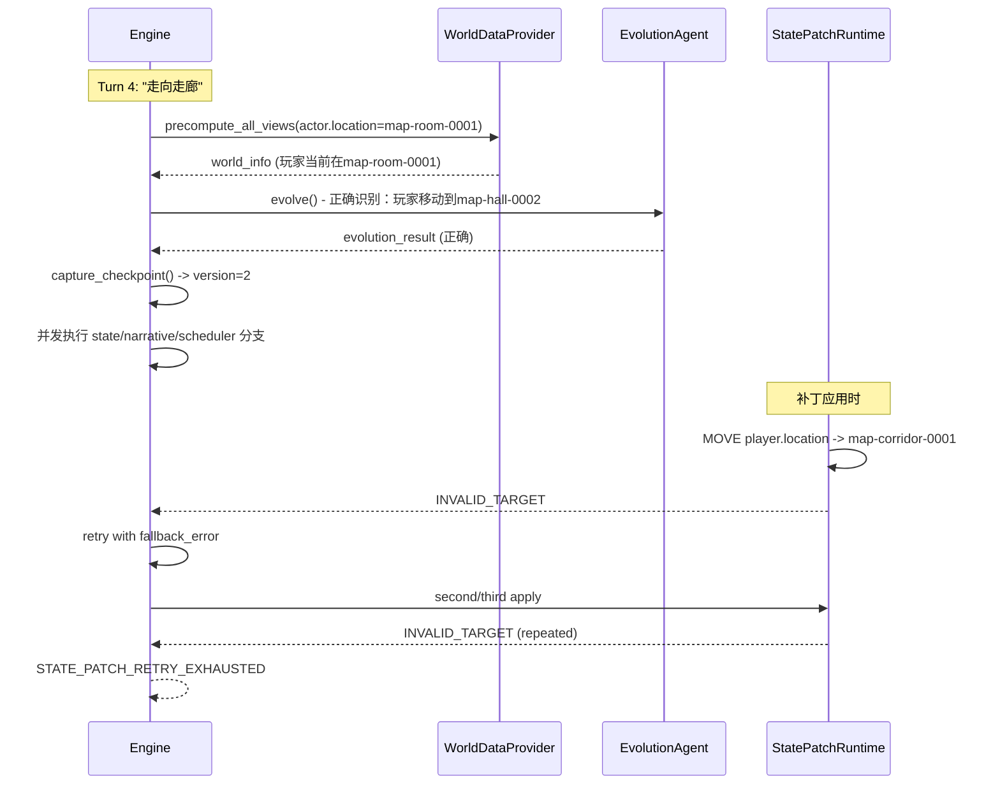

# Phase3/4/5 Debug Review Report

**Date**: 2026-04-18  
**Analysts**: Claude  
**Status**: Issue Identified

---

## Issue 1: STATE_PATCH_RETRY_EXHAUSTED

### Problem Summary

执行 Turn 4 "走向走廊"（移动到走廊）时，出现：
- `state.ok: False`
- `state.fallback_error.code: "STATE_PATCH_RETRY_EXHAUSTED"`
- `actor.location: map-room-0001` (玩家仍在值班室，未能移动)
- `narrative_triggered: False` (叙事被清空)

### Root Cause Analysis

**核心问题：State Patch 目标地图 ID 无效（INVALID_TARGET）**

根据运行日志，首次失败不是版本断言，而是 MOVE 到不存在目标：

- `details.invalid_target: "map-corridor-0001"`
- `code: "INVALID_TARGET"`

这会导致 state 分支重试，若重试期间仍输出无效目标，则最终进入 `STATE_PATCH_RETRY_EXHAUSTED`。

说明：报告中原先将问题定性为“版本不一致/时序并发”的主因，和本次日志证据不一致。版本断言路径存在，但本次故障链路未显示其为首个触发点。

问题链路位于 [`_run_phase3_turn_async`](src/engine/engine.py:467) 与 state patch 应用阶段：



### Key Findings

**1. [首个失败点是 INVALID_TARGET，不是 ASSERT_FAILED](world/log/agent_io.jsonl)**

- 失败日志在 state patch 反馈中直接显示 `INVALID_TARGET`。
- `STATE_PATCH_RETRY_EXHAUSTED` 是重试耗尽后的最终包装错误码，不应被直接当作原始根因。

**2. [expected_version 来源于系统注入，不是 LLM 生成](src/agent/llm/statechange_agent.py)**

`patch_meta.expected_version` 来自 `execution.world_version`，属于系统侧控制字段。

**3. [state agent 视图可见性限制会放大跨地图目标幻觉风险](src/utils/world_provider.py)**

```python
state_input = StateAgentInput(
    llm_input=StateAgentLlmInput(
        e4=e4,
        world_info=context["views"].state_agent_view,  # 来自预计算（基于当前世界）
        fallback_error=None,
    ),
    system_input=StateAgentSystemInput(
        execution=SystemExecutionMeta(
            world_version=int(checkpoint["version"]),  # 来自checkpoint
            ...
        ),
    ),
)
```

- 当前 state 视图以“当前位置可见实体”为主。
- 当自然语言出现“走廊/大厅”等别名时，LLM 可能生成不存在的 map id（如 `map-corridor-0001`）。

**4. [版本断言逻辑存在且合理，但非本案首因](src/rule/state_patch.py)**

```python
expected_version = patch_meta.expected_version
if expected_version is not None and snapshot.get("version") != expected_version:
    raise StatePatchError(
        code=ERROR_ASSERT_FAILED,
        message="snapshot version mismatch",
        details={"expected_version": expected_version, "actual_version": snapshot.get("version")},
    )
```

版本断言用于保护快照一致性，应保留为系统防线。当前证据不足以支持“移除断言可解决本次故障”。

### Why actor.location Remains map-room-0001

当 `STATE_PATCH_RETRY_EXHAUSTED` 时，[_run_state_branch:1065](src/engine/engine.py:1065) 执行 rollback：

```python
async with self._state_commit_lock:
    await asyncio.to_thread(self.world_state.restore_checkpoint, checkpoint)
```

世界状态回滚到 checkpoint，**玩家的移动没有生效**。

### Why narrative_triggered: False

[engine.py:607-614](src/engine/engine.py:607) 当 `fallback_error is not None` 时：

```python
if fallback_error is not None:
    narrative_payload = {"llm_output": {"narrative_str": ""}, ...}  # 叙事被清空
```

### Root Cause Summary

| 问题点 | 描述 |
|--------|------|
| **首因是 INVALID_TARGET** | state patch MOVE 的目标地图 id 不存在（`map-corridor-0001`） |
| **重试纠错信号不足** | 回退重试阶段若缺少合法候选目标，LLM 容易重复同类错误 |
| **跨地图语义到 id 映射不稳** | 自然语言地名别名与系统 map id 未建立稳定映射 |
| **Rollback 导致状态丢失** | 补丁应用失败后 rollback，玩家的移动没有生效 |

### Recommended Fixes

1. **方案 A（已落地方向）**：在 state 视图中显式提供可选目标地图 ID，降低幻觉目标概率
2. **方案 B（已落地方向）**：`INVALID_TARGET` 错误 details 返回合法目标列表，提升重试自纠能力

**结论**：本次主因是 **无效目标 id** 导致的补丁失败与重试耗尽。并发/版本是系统性风险点，但不是本次首要触发因。

---

## Issue 2: NPC Cannot Invoke Check/Evolution Agent

### Problem Summary

根据 [`docs/spec/draft_spec.md`](../spec/draft_spec.md) 的规范，NPC 应该能够唤起鉴定（check）或 evolution_agent，但当前实现中 NPC performer 的输出缺少相关字段。

### Root Cause Analysis

**1. [NpcPerformerAgentLlmOutput 缺少 check 字段](src/agent/llm/npc_perform_agent.py:29-49)**

```python
class NpcPerformerAgentLlmOutput(AgentLlmOutputBase):
    intent: str = Field(default="", description="NPC 互动类型")
    action_text: str = Field(default="", description="npc 输出行为文本")
    change_basic_goal: Optional[str] = None
    change_active_goal: Optional[str] = None
    # ❌ Missing check fields per spec:
    # - routing_hint
    # - attributes  
    # - against_char_id
    # - difficulty
```

根据规范，NPC performer 应该能够输出：
- `routing_hint`: 路由提示（"num" | "against" | null）
- `attributes`: 鉴定所需的属性列表(为ai提供可用属性列表像DMagent一样)
- `against_char_id`: 对抗鉴定参与的对象ID列表
- `difficulty`: 鉴定难度(对抗鉴定利用两边的数值差距来决定难度,而数值鉴定依靠自身数值决定难度,不交由ai决定鉴定难度,也即ai只需要输出路由提示,鉴定属性列表,以及对抗鉴定参与的id列表)

**2. [_run_performer_branch 不处理 check 逻辑](src/engine/engine.py:771-853)**

```python
async def _run_performer_branch(
    self,
    scheduler_out: NpcSchedulerAgentOutput,
    ...
) -> List[NpcPerformerAgentOutput]:
    scheduled_npc_ids = scheduler_out.llm_output.step_result.scheduled_npc_ids
    if not scheduled_npc_ids:
        return []
    
    outputs: List[NpcPerformerAgentOutput] = []
    for npc_id in scheduled_npc_ids:
        output = await asyncio.to_thread(self.npc_performer_agent.run, agent_input=npc_input)
        outputs.append(output)
        # ❌ 没有处理 check 逻辑
    
    return outputs
```

当前代码只收集 NPC 的行为输出，**没有检查是否需要触发鉴定**。

**3. 规范要求 vs 实现差异**

| 规范要求 | 当前实现 |
|----------|----------|
| NPC 可唤起 check | ❌ NpcPerformerAgentLlmOutput 缺少 check 字段 |
| NPC 可唤起 evolution_agent | ❌ performer 分支不调用 evolution |
| NPC 输出包含 routing_hint, attributes 等 | ❌ 当前只有 intent, action_text, goal 字段 |

### Recommended Fixes

1. **扩展 NpcPerformerAgentLlmOutput**：添加 `routing_hint`, `attributes`, `against_char_id`, `difficulty` 字段
2. **修改 _run_performer_branch**：在收集 NPC 输出后，检查是否需要触发 check 或 evolution
3. **添加 NPC check 处理逻辑**：如果 NPC 输出包含 check 路由，转交给 rule_system 处理

定位说明：该问题属于“能力缺失/规范差距”，与 Issue 1 的运行时崩溃并非同一根因链路。

---

## Cross-Map State Management Suggestions

以下建议按实施优先级排序，目标是降低跨地图动作失败率并提升系统可解释性。

### P0: 输入归一化与合法目标约束（低成本高收益）


1. **动作前校验**：state patch apply 前做 `target_map_id in valid_targets` 预校验，不通过则先做纠正而非直接提交。
2. **错误闭环增强**：重试反馈固定包含 `valid_target_map_ids` 与最近一次非法值，鼓励 LLM 替换而非重试同值。

### P1: 跨地图移动语义建模（中成本）

1. **路径可达校验**：通过地图连通关系验证 `from -> to` 是否允许，不可达则返回结构化错误（如 `UNREACHABLE_MAP`）。
2. **单一事实源**：位置只以 `character.location` 为真值，背包/场景同步由派生规则处理，避免双写冲突。
3. **指标面板**：持续统计 `INVALID_TARGET`、`UNREACHABLE_MAP`、重试次数分布，作为 prompt 与规则调优输入。

### P2: 事务与可观测性强化（中高成本）

1. **两阶段提交草案**：`validate patch` -> `commit patch`，在 validate 阶段完成版本、目标、可达性检查。
2. **冲突签名与去重**：为每条跨地图变更生成 `(entity, op, target)` 签名，重试时去重。
3. **MoveIntent 中间层**：将“去走廊”先解析成 `MoveIntent(destination_alias="走廊")`，再由系统解析出 canonical map id。

### References

- Spec: [`docs/spec/draft_spec.md`](../spec/draft_spec.md)
- NPC Performer Agent: [`src/agent/llm/npc_perform_agent.py`](src/agent/llm/npc_perform_agent.py)
- Engine Performer Branch: [`src/engine/engine.py:771-853`](src/engine/engine.py:771)

---

## Summary

| Issue | Severity | Root Cause | Type |
|-------|----------|------------|------|
| STATE_PATCH_RETRY_EXHAUSTED | High | INVALID_TARGET 导致重试耗尽并回滚 | Runtime Robustness Bug |
| NPC Cannot Invoke Check/Evolution | Medium | 缺少 check 字段和分支处理逻辑 | Missing Feature |
