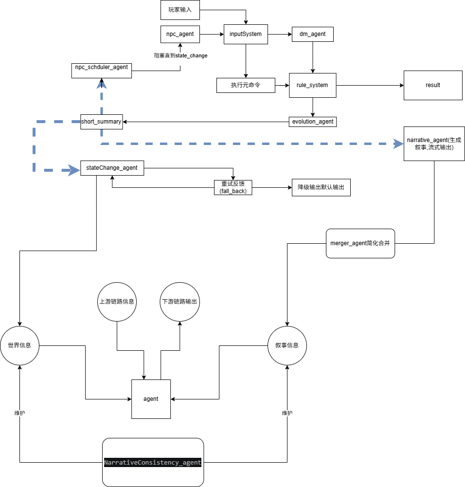

蓝色虚线是并发部分，完整介绍
# LLM驱动的文字冒险游戏

## 实体 ID 系统规范
    解决原设计中 ID 命名不严谨、实体冲突、管理困难的问题，统一全引擎实体唯一标识标准
1.  固定命名格式
plaintext
[实体类型]-[有意义名称]-[唯一后缀]
2. 字段定义与约束
表格
字段	可选值 / 约束	说明	示例
实体类型	固定枚举：map/char/item	严格区分实体类型，禁止自定义	map-bedroom、char-innkeeper、item-roomkey
有意义名称	小写英文、下划线分隔，禁止特殊字符	见名知意，对应实体核心含义	禁止使用无意义随机字符串
唯一后缀	4 位递增数字，全局唯一	保证 ID 全局唯一性，避免重名冲突	map-bedroom-0000
3. 补充规则
    玩家实体固定 ID：char-player-0000，全局唯一
    所有实体 ID 必须在创建时完成全局唯一性校验，重复 ID 禁止入库
    实体 ID 创建后永久不可修改，实体删除后 ID 归档，禁止复用
    所有引擎模块必须通过 ID 索引实体，禁止通过名称 / 描述索引

## 条件系统(DSL):
    1. 目前仅用于结局判定
    2. DSL语法定义（简化版）
       - 条件表达式：`[实体ID].[属性] [操作符] [值]`
       - 支持操作符：`==`, `!=`, `>`, `<`, `>=`, `<=`, `in`, `not in`
       - 复合条件：`and`, `or`, `not` 连接
       - 示例：`char-player-0000.health > 0 and item-key-0000.location in [char-player-0000, map-room-0001]`

## 系统运行流程:

```

系统总览

这是一套带输入分支路由、LLM与规则双驱动、带状态回滚容错的交互式多智能体游戏叙事系统，核心逻辑为：inputSystem负责输入类型分流，底层元命令跳过LLM链直接走规则引擎，自然语言输入进入LLM导演链；蓝色虚线代表并发执行的独立分支流程，同时内置「重试-降级-回滚」的完整容错机制。


---
一、输入分流与核心主链路（核心修正点）

1. 输入入口与分流逻辑

玩家输入 + npc_agent（NPC行为代理）的NPC自主行为输入，共同进入inputSystem（输入系统），由其完成输入类型判定与分支路由：

- 分支A：底层元命令（如\look等指令）：直接跳过所有LLM调用链，仅将元命令传递给rule_system（规则系统），由rule_system直接生成元命令执行结果（result），该分支流程直接结束

- 分支B：自然语言描述输入：不直接进入rule_system，而是交给dm_agent（导演代理），进入完整LLM调用链

2. LLM调用链（自然语言输入专属）

dm_agent对自然语言输入做意图解析、语义理解、叙事合理性校验后，将结构化后的输入传递给rule_system，由rule_system完成游戏规则判定、逻辑校验，生成最终执行结果

- rule_system的结果一方面输出result（自然语言输入的执行结果），另一方面驱动evolution_agent（世界演化代理），执行世界状态变更的计算逻辑

3. NPC阻塞机制

npc_agent会被阻塞直到state_change（世界状态变更完成，含重试/回滚全流程结束），才会生成下一轮NPC行为输入，保证NPC行为始终基于最新、有效的世界状态


---
二、蓝色虚线标注的并发执行分支

evolution_agent完成世界演化计算后，同时并发触发两个独立任务（蓝色虚线）：

1. 并发分支1：生成short_summary（本次交互的短摘要，包含完整状态变更信息）

2. 并发分支2：将演化结果直接发送给narrative_agent（叙事代理），由其生成自然语言叙事，进行流式输出

short_summary生成后，再次并发触发两个独立任务（蓝色虚线）：

1. 并发分支A：发送给npc_scheduler_agent（NPC调度代理），用于规划后续NPC的自主行为

2. 并发分支B：发送给stateChange_agent（状态变更代理），驱动全局世界状态的正式更新


---
三、状态变更与容错机制（完全按你的需求修正）

stateChange_agent接收short_summary的状态变更指令，执行世界状态更新操作，容错逻辑如下：

1. 若状态变更失败，触发持续重试反馈（fall_back）：stateChange_agent会进行多次自动重试

2. 若多次重试仍失败：

  - ① 触发降级逻辑：输出默认兜底输出，保证用户体验不中断

  - ② 执行状态回滚：将世界状态完全恢复到本次输入执行前的状态，避免脏数据

3. 重试成功/降级回滚完成后，将最终有效状态同步到「世界信息」全局状态池


---
四、叙事后处理与NPC行为闭环

1. 叙事后处理：narrative_agent生成的流式叙事输出，进入merger_agent（合并代理），完成简化、去重、逻辑合并，再同步到「叙事信息」全局状态池

2. NPC行为闭环：npc_scheduler_agent基于short_summary的状态信息，生成NPC行为调度指令，驱动npc_agent生成新的NPC行为输入，重新进入inputSystem，形成NPC自主行为的完整闭环


---
五、全局一致性保障与底层支撑

1. 双状态池架构：系统维护两个核心全局状态，由专门代理保障一致性：

  - 「世界信息」：存储所有实体、场景、属性等客观世界状态，由stateChange_agent同步更新

  - 「叙事信息」：存储所有已发生的叙事事件、对话、因果关系等主观叙事状态，由merger_agent同步更新

2. 一致性核心：NarrativeConsistency_agent（叙事一致性代理）同时维护、校验两个状态池，保障世界状态与叙事逻辑的全局自洽，避免出现逻辑矛盾

3. 通用代理支撑：基础agent模块从「世界信息」获取全局状态，接收上游链路信息、产生下游链路输出，为所有上层代理提供通用能力支撑


```
## 数据模型
### 世界模型:

#### 描述系统(description):
    - public-List[str] :一个可以只可以被系统层代码写入的字段,记录实体的默认可见信息
    - hint-str :一个提供给agent的信息,用于引导玩家,只读
    - add-List[Dict[Timetable,str]] :用来暂存实体信息变化的字段，每10个回合激活一致性agent维护并清空，将当前情况写入public

#### 记忆系统(Memory角色专有):
     Memory {
  // 完整对话/行为日志，仅用于debug与回溯，不进入LLM上下文
  log: List[
    LOG{
    turn: number;
    content: string;
    timestamp: number;
    }
  ];
  // 向量数据库存储的长期记忆，用于关键事实检索,暂时不做,保留接口
  longTermMemory: {
    vectorId: string;
    // 记忆关键摘要
    summary: string;
    // 发生背景
    turn: string;
  }[];
  // 调度器提供的本回合额外信息，保留10回合
  currentEvent: string;
  // 短期叙事记忆，默认保留最近15回合
  short: string[];
  // 短期日志，提供给一致性系统使用，默认保留最近30回合
  shortLog: Array<{
    turn: number;
    event: string;
  }>;
  // 关键事实库，由一致性系统从shortLog/长期记忆中提取，永久保留，核心上下文
  keyFacts: string[];
}
#### 目标模型(Goal):由npc自行维护
    - baseGoal:基本目标,开始时由设定提供,可被npc自动写入
    - activeGoal:当前计划,可被npc自动写入
    - goalHistory:目标历史,每当npc,写入新的Goal时加入被覆盖的Goal,仅向NPC展示前3GOAL
    

#### 地图信息:
    - id-[str]:地图id
    - name:名称
    - description:描述系统
    - parent-Dict[id,name]:父级区域
    - child-List[Dict[id,name]]:子级区域 
    -  connection-List[
        Connction{
            - id,
            - name(str),
            - direction,
            - descrption,
            - isLocked,
            - condition
        }
    ]
    - charDist-Dict[id,name(str)]:哪些人物在
    - itmeDist-Dict[id,name(str)]:哪些物品在
    - extra:?

#### 物品信息:
    - id
    - name
    - description
    - location
    - is_protable
    - extra:?

#### 人物信息:
    - id 
    - name
    - basic_info
    - location
    - status [Status]:人物状态
    - aribute [Attributes]  :属性信息
    - Memory [Memory]
    - Goal [Goal]
    - extra:?
### Attrubutes/Status(支持自定义属性与状态):
Attribute {
  id: string;
  name: string;
  value: number;
  maxValue: number; //不会提供给agent,仅用于系统
  minValue: number; //同上
  // 属性描述，用于Agent理解
  description: string;
}

// 状态：角色,血量,san值等
 Status {
  id: string;
  name: string;
  value: number;
  maxValue: number; //不会提供给agent,仅用于系统
  minValue: number; //同上
  // 属性描述，用于Agent理解
  description: string;
}

### 上下文信息模型:
    E1:世界信息
      - 描述层
        - 切片(不完整)
        - 视图(完整)
      - 数值层
        -仅state_agent消费
    E2:叙事信息
        - recent(最近5回合,多的被压入到narrative当中)
        - NarrativeLog(记录用以debug)
    E3:链路信息
        e1:输入信息:输入系统的原始信息
        e2:意图诠释:系统对该原始信息的理解,由dm_agent产生，帮助信息路由到不同地方
        e3:规则结算事实:系统的客观判断,由rulesystem产生
        e4:步骤结算:系统的推演结算,由evolution_agent,scheduler产生
        e7:回合因果链:每个链路信息的时序关系,记录步骤结算e4,包含时间戳
    E4:叙事投影: 结算出的新叙事信息,由narrative_agent产生片段,最后由merger_agent负责合并成简短记录,作为叙事真值,写入到叙事信息中的recent当中
    E5:世界投影: 结算出的新世界信息,由state_change_agent产生,并直接写入到持久化数据库中


### agent模型:
    - id: 名称
    - skill: 初始提示词,包含其要做什么
    - 链路输入
          -  dmagent
              - e1
         -   evolution
                -  e1
                -  e3
                -  e7
         -  state
               -  e4
               - fallbackerror
        -   npcscheduler
               -  e4
        -  npcperformer
               -  e4来自scheduler提供的npc在本回合内需要知晓的额外信息
               -  e1
       -  narrative
               - e4来自evolution
       - merger_agent:
                - e7
    - 世界信息
        -   描述层
            - dm
                - 视图
            - evolution
                - 视图
            - state
                - 视图
            - npcschduler
                - 切片
            - narrative&merger
                - 切片
            - npc&玩家
                - 切片
        - 数值层
            - state

    - 叙事信息(NarrativeLog)
        -  dm
        - evolution
        -  npcschduler
        - narrative
    
    - agent_memory
         -  dm
             -  对话信息(最近5回合,多余压入Log)
             -  dilogueLog
          -  npc
              -  Memory
    